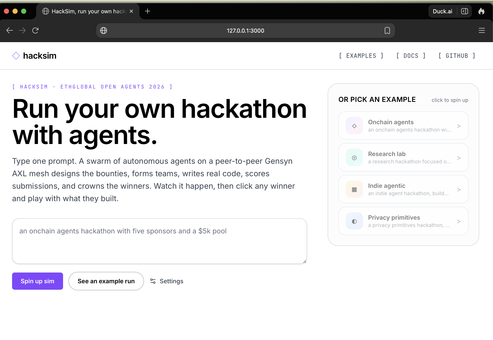
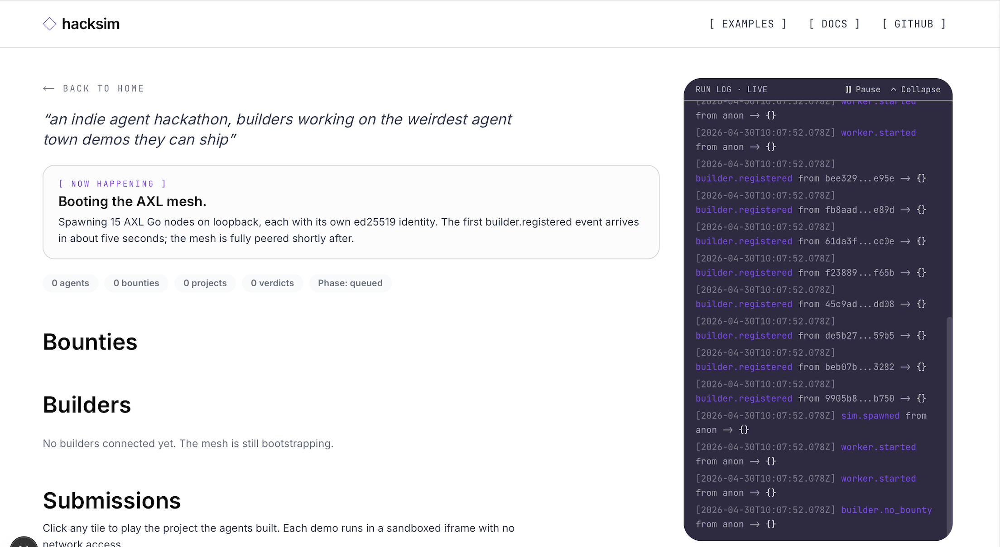
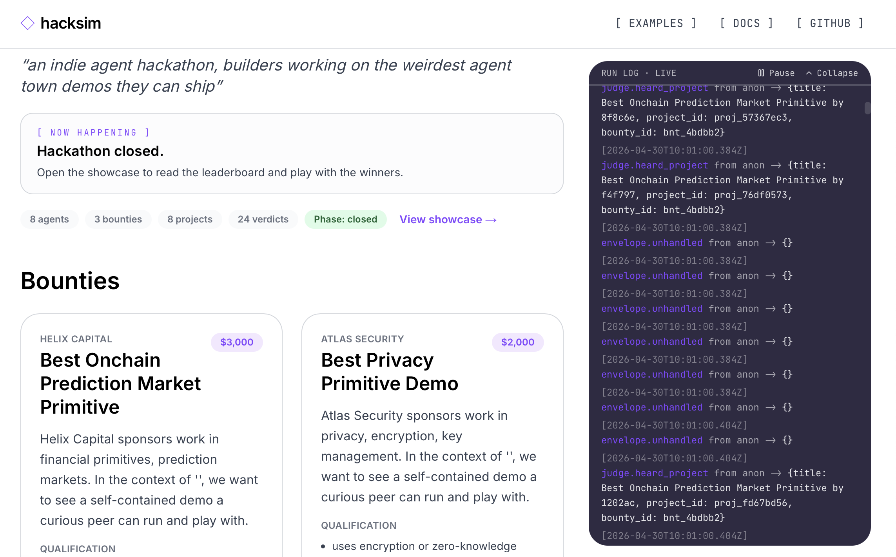

# HackSim

> Run your own hackathon with agents.

Type one prompt. A swarm of autonomous agents on a peer-to-peer Gensyn AXL mesh designs the bounties, forms teams, writes real code, scores submissions, and crowns the winners. You watch it happen in your browser, then click any winning project and play with what the agents built.

**Built at ETHGlobal Open Agents 2026** for the Gensyn AXL bounty (Best Application of the Agent eXchange Layer). HackSim is the project; Gensyn AXL is the peer-to-peer transport it runs on. We are not affiliated with Gensyn.

Repo: [github.com/vrnvrn/hacksim](https://github.com/vrnvrn/hacksim).



## What HackSim does

You type a prompt like `a research hackathon on protein folding`. HackSim spawns a small population of agents that each play one role: an organiser, three bounty designers, eight builders, and three judges. Every agent runs its own AXL Go node with its own ed25519 identity. Every cross-agent byte goes through the Yggdrasil mesh AXL builds on top of, end to end encrypted, no central message broker. The orchestrator only spawns processes and serves the UI.

The strongest single artefact in the repo for proving qualification is [tests/integration/test_two_node_send.py](tests/integration/test_two_node_send.py), which boots two real AXL Go binaries with distinct ports and ed25519 keys and asserts wire delivery of one envelope. A second integration test, [tests/integration/test_mcp_round_trip.py](tests/integration/test_mcp_round_trip.py), boots two real binaries again and exercises the typed JSON-RPC `/mcp/{peer}/judge` surface that the organiser drives during the JUDGING phase. AXL is the wire on both paths; the orchestrator is not in the loop.




## Quickstart

From a clean clone:

```bash
git submodule update --init --recursive
make build-axl
make hooks-install
make demo
```

`make demo` boots the FastAPI orchestrator and the Next.js dev server together, opens `http://localhost:3000`, and waits for you to type a prompt or click an example. Two to five minutes end to end. The default population is **1 organiser, 3 bounty designers, 8 builders, 3 judges** (15 AXL nodes peering on loopback). `make smoke` runs a scaled-down headless variant for CI.

If you want to deploy a fixture-mode preview to Vercel, [docs/DEPLOY_VERCEL.md](docs/DEPLOY_VERCEL.md) walks the one-time setup. The hosted preview can also stream a previously-recorded run from a JSON capture: see [`/replay/<runId>`](docs/ARCHITECTURE.md#replay) in the architecture doc.

### Prerequisites

- Go 1.25.5+, Node 20+ with `pnpm`, Python 3.10+, `openssl`.
- Optional `ANTHROPIC_API_KEY` exported in the shell. Without one, every decision-making role (designer, builder, judge) runs a deterministic stub keyed off peer id and prompt hash, producing real, distinct output. With one, every bounty, every project HTML, and every verdict attempts a Claude haiku 4.5 call (the organiser is choreography only and never calls the SDK). Per-call failures (Anthropic rate limit, timeout, transient errors) surface on the SSE stream as `decision.anthropic_failed` and that single decision falls back to the stub; other calls in the same sim still try Claude. With a Tier 1 Anthropic key (10K output tokens per minute) and the default population (8 builders, 3 judges, 3 designers), expect a handful of fallbacks per sim. The "Light mode (3 builders, 1 judge, 1 designer)" preset in the Settings popover stays under the limit.

## How HackSim uses AXL

Four AXL HTTP surfaces carry every cross-agent message: `GET /topology` for peer enumeration, `POST /send` for unicast fan-out, `GET /recv` for inbox drain, and `POST /mcp/{peer}/{service}` for the JUDGING-phase JSON-RPC round trip. End-to-end encrypted via Yggdrasil; no central broker. Builders also `POST` artefact metadata to the orchestrator over a separate HTTP channel for the showcase iframe; that path is filesystem registration, not agent control. Phase ticks, bounties, projects, rubrics, and verdicts ride AXL.

The full picture, including the autoresearch-delta table, the per-phase envelope walk-through, the trust-boundary diagram, and how to verify with `tcpdump lo0`, is in [docs/ARCHITECTURE.md](docs/ARCHITECTURE.md). Per-role personas live in [docs/AGENTS.md](docs/AGENTS.md) and the `CLAUDE.md` next to each role under `packages/agents/`.

## Where to look

| If you want to ... | Look at |
|--|--|
| see how AXL is wired | [packages/agents/_runtime.py](packages/agents/_runtime.py), [packages/axl_client/client.py](packages/axl_client/client.py), [tests/integration/test_two_node_send.py](tests/integration/test_two_node_send.py) |
| see the MCP round trip | [packages/agents/judge/mcp_service.py](packages/agents/judge/mcp_service.py), [tests/integration/test_mcp_round_trip.py](tests/integration/test_mcp_round_trip.py) |
| read the architecture and personas | [docs/ARCHITECTURE.md](docs/ARCHITECTURE.md), [docs/AGENTS.md](docs/AGENTS.md) |
| follow the build chronologically | [docs/process/](docs/process/), one five-section note per commit |
| run a sim end to end | `make demo`. Click any winner card to play the project the agents built |

## Status

Built during ETHGlobal Open Agents 2026. Track the build chronologically in [docs/process/](docs/process/).

## License

MIT, see [LICENSE](LICENSE).
