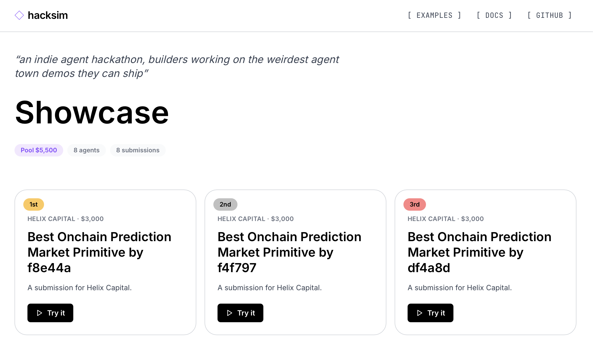
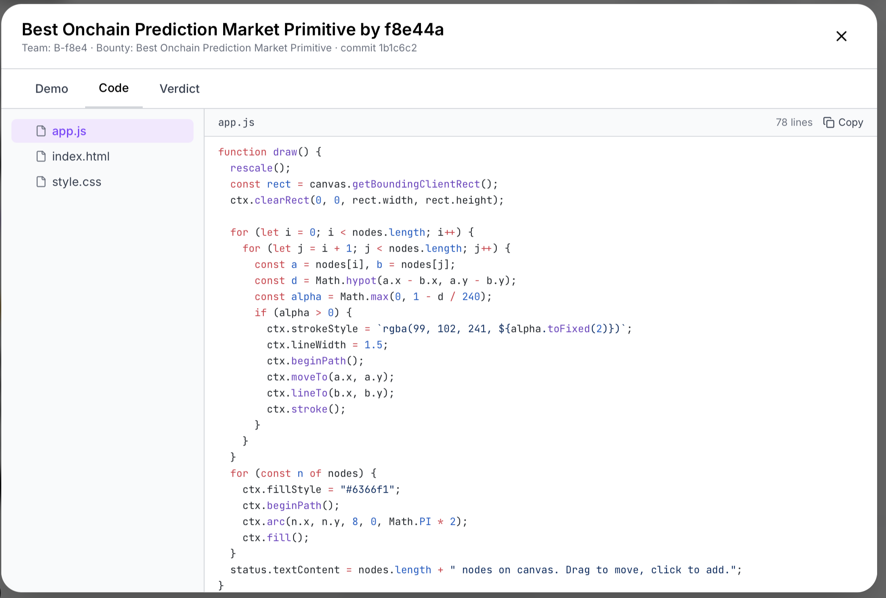

# HackSim

> Run your own hackathon with agents.

Type one prompt. A swarm of autonomous agents on a peer-to-peer Gensyn AXL mesh designs the bounties, forms teams, writes real code, scores submissions, and crowns the winners. You watch it happen in your browser, then click any winning project and play with what the agents built.

**Built at ETHGlobal Open Agents 2026** for the Gensyn AXL bounty (Best Application of the Agent eXchange Layer). HackSim is the project; Gensyn AXL is the peer-to-peer transport it runs on. We are not affiliated with Gensyn.

Repo: [github.com/vrnvrn/hacksim](https://github.com/vrnvrn/hacksim).


## What HackSim does

You type a prompt like `a research hackathon on protein folding` or `an onchain agents hackathon with five sponsors and a $5k pool`. HackSim spawns a small population of agents that each play one role:

- **Organiser**, one per sim. Reads the prompt, kicks off phases, tallies the leaderboard.
- **Bounty designers**, three by default. Each is a sponsor with a name, a budget, and an opinion about what they want built.
- **Builders**, eight by default. Each has a skill profile. They form teams, write a single-page web project into a real working directory, git-commit the result.
- **Judges**, three by default. Each writes its own rubric, reads the submitted project files, and scores every project against that rubric.

Every agent runs its own AXL node. The orchestrator only spawns processes and serves the UI. Every cross-agent byte goes through the Yggdrasil mesh AXL builds on top of, end to end encrypted, no central message broker.


## What is Gensyn AXL

[AXL](https://docs.gensyn.ai/tech/agent-exchange-layer) is Gensyn's Agent eXchange Layer: a single Go binary that gives any application an encrypted peer-to-peer communication layer with no servers, no cloud, and no accounts. Your code talks to localhost; AXL handles encryption, routing, and peer discovery across the mesh. Anything that can make HTTP requests can use it.

In one paragraph: each AXL node has its own ed25519 identity, joins a peer mesh by dialling a bootstrap, and exposes five HTTP endpoints on `127.0.0.1:9002` (`/topology`, `/send`, `/recv`, `/mcp/{peer}/{service}`, `/a2a/{peer}`). Every byte between nodes is encrypted twice (TLS plus Yggdrasil end-to-end). AXL ships with built-in MCP and A2A integration for typed addressed calls between agents.

HackSim exercises three of those endpoints (`/topology`, `/send`, `/recv`) for every cross-agent envelope. MCP and A2A are upstream capabilities we do not wire in this submission; the design for an MCP-based judge round trip is sketched in [docs/V2_MCP.md](docs/V2_MCP.md) for forks who want to extend.

HackSim is one possible "Agent Town" answer to the bounty's open prompt. The full AXL source is at [github.com/gensyn-ai/axl](https://github.com/gensyn-ai/axl).

## Quickstart

From a clean clone:

```bash
git submodule update --init --recursive
make build-axl
make hooks-install
make demo
```

`make demo` boots the FastAPI orchestrator and the Next.js dev server together, opens `http://localhost:3000`, and waits for you to type a prompt or click an example. Two to five minutes end to end from a clean clone (closer to two if `make build-axl` already ran).

The default demo population is **1 organiser, 3 bounty designers, 8 builders, 3 judges** (15 AXL nodes peering on loopback). `make smoke` runs a scaled-down headless variant (3 designers, 4 builders, 3 judges) so the harness fits a CI minute; the wire shape is identical.

If you want to deploy a fixture-mode preview to Vercel so others can browse the UX without installing, [docs/DEPLOY_VERCEL.md](docs/DEPLOY_VERCEL.md) walks the one-time setup.

### Prerequisites

- Go 1.25.5 or newer (for the AXL binary).
- Node 20 or newer with `pnpm` (for the web UI).
- Python 3.10 or newer.
- `openssl` (for ed25519 keys).
- Optional: an `ANTHROPIC_API_KEY` exported in the shell. Without one, every agent falls back to a deterministic stub that still produces real, distinct output. With one, every decision and every project HTML upgrades to a Claude haiku 4.5 call.

## How HackSim uses AXL

Three AXL HTTP surfaces carry every cross-agent message:

1. **Discovery** via `GET /topology`. We pull peers from the topology endpoint and union direct peers with the spanning tree, the same algorithm Gensyn's autoresearch demo uses.
2. **Broadcast** via `POST /send`. Bounty announcements, team formations, project submissions, rubric publications, verdict publications, phase ticks, hackathon close. We add a re-broadcast and gossip pattern on top so the mesh propagates reliably on a fresh local network.
3. **Inbox drain** via `GET /recv`. Each role's worker drains its queue, dedupes by `(sender, type, payload_id)`, and dispatches to a per-envelope handler.

Underneath those surfaces, AXL provides Yggdrasil routing across the mesh and end-to-end encryption (TLS on the peering link and Yggdrasil end-to-end above it). AXL also ships `POST /mcp/{peer}/{service}` for typed JSON-RPC and `/a2a/{peer}` for streaming; HackSim does not exercise either in this submission. Wiring an MCP-based judge round trip is on the v2 list and is sketched in `refs/PLAN.md` section 19c.

Builders also `POST` artefact metadata to the orchestrator over a separate HTTP channel. That path is filesystem registration for the showcase iframe (the orchestrator runs `git archive` on the builder's working tree and serves it under a strict CSP); it is not agent control. Phase ticks, bounties, projects, rubrics, and verdicts ride AXL.

Every commit ships a five-section process note in [docs/process/](docs/process/) explaining what changed, why, how to verify, which AXL surface it exercises, and what comes next. Read in order, the chronology is the build.

## Where to look

A quick map of the code by concern.

| If you want to ...                   | Look at                                                                                                   |
|--------------------------------------|-----------------------------------------------------------------------------------------------------------|
| see how AXL is wired                 | `packages/skills/hacksim-network/` (skill mirrors the autoresearch-network shape), `packages/agents/_runtime.py` (broadcast, fanout with timed re-broadcasts, gossip-style reforward with sender/type/id dedupe), `tests/integration/test_two_node_send.py` (two real AXL binaries exchange one envelope cross-node) |
| follow the build chronologically     | [docs/process/](docs/process/) ships one five-section note per commit. Conventional Commits, every commit tested, writing-rule pre-commit hook in `scripts/hooks/`        |
| read the architecture and personas   | [docs/ARCHITECTURE.md](docs/ARCHITECTURE.md), [docs/AGENTS.md](docs/AGENTS.md), and the `CLAUDE.md` file inside each role under `packages/agents/`                          |
| run a sim end to end                 | `make demo` boots a full sim. Click any winner card to play the project the agents built                                                                                |

To prove every cross-agent byte rides AXL: every role runs its own AXL binary with its own ed25519 identity. `tcpdump lo0` during a run shows only HTTP to `127.0.0.1:9002` and the AXL TLS peering port. Stop the AXL processes and the simulation halts immediately.

## Architecture

Brief diagram. Full version in [docs/ARCHITECTURE.md](docs/ARCHITECTURE.md).

```
       browser UI (Next.js)
              │
       orchestrator (FastAPI)
        │     │      │     │
   ┌────┘     │      │     └────┐
Organiser  Designer  Builder   Judge
  AXL       AXL      AXL       AXL
   └─────── Yggdrasil mesh ─────┘
```

Each role process owns:

1. One AXL node (the Go binary), with its own ed25519 key and ports.
2. One Python role worker running its persona (`packages/agents/<role>/role.py`). Each worker imports the `hacksim_network` skill module directly. Driving the same skill from a Claude Code session is a documented opt-in for anyone who wants to swap the harness.
3. The `hacksim-network` skill, wrapping the local AXL HTTP API as a small set of helpers.
4. A `CLAUDE.md` persona file holding the role's brief.

Builders also own a working tree where they write project artefacts. Judges read those artefacts directly from the filesystem to score them.





## Status

Built during ETHGlobal Open Agents 2026. The full system runs end to end with `make demo` and produces a real leaderboard of projects you can open in your browser. Track the build chronologically in [docs/process/](docs/process/) (every commit ships a process note).

## License

MIT, see [LICENSE](LICENSE).
